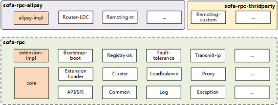
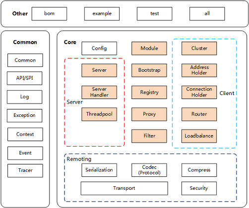

---
title: "SOFARPC architecture"
aliases: "/sofa-rpc/docs/Structure-Intro"
---

SOFARPC is divided into two layers from bottom to top:

1. Core layer: It contains the core components of RPC (such as various interfaces, APIs and common packages) and some common implementations (such as random load balancing algorithms).
2. Function implementation layer: All users of the function implementation layer are equal, and all functions are implemented based on the extension mechanism.

The internal version specific for Ant Financial just has some internal extension based on the open source version.

Of course, you can add your own third-party extension. See [Extension mechanism](../extension-loader) for more information.

## Module division

The implementation classes of each module only appear in the modules. Generally, the modules don't depend on each other. The modules that require cross dependency have been abstracted into the core or common modules.

Currently, SOFARPC is divided into the following modules:

The main modules and their corresponding dependencies are as follows:

Module|Submodule|Definition|Description|Dependency
-------|-------|-----|-----|-----
all | | Publish and packing module| |All modules that need to be packaged
bom | |Dependency control module |Control dependency version| None
example | | Sample module | |all
test | | Test module | Include integration test | all
core | api | API module | Include various basic process interfaces, messages, contexts, extension interfaces and others | Common
core |common | Public module |Include utils and data structure | exception
core |exception|Exception module | Include various exception interfaces and others | common
bootstrap| |Startup implementation module |Include start class, service publish or reference logic, and registry operations | core
proxy | | Proxy implementation module | Generate interface implementation proxy| core
Client | | Client implementation module | Send request, receive response, maintain connections, routing, and implement load balancing, synchronization, asynchronization and other operations |
server | | Server implementation module | Start listening, receive requests, send responses, distribute business threads, and implement other operations |
filter | | Interceptor implementation module |Implement various interceptors for server and client | core
codec | | Coding and encoding implementation module | Implement compression, serialization and other operations | core
protocol | | Protocol implementation module | Package and process protocol and conduct negotiation | core
transport| |Network transmission implementation module | Establish TCP connection, process sticky data packets, and distribute requested response objects |
registry | |Registry center implementation module|Implement registration centers, such as ZooKeeper | core
