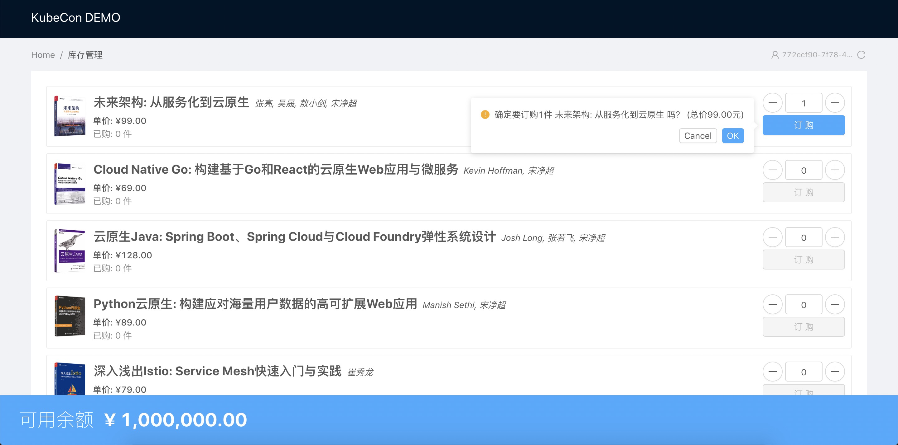

作为云原生技术前进方向之一，Serverless 架构让您进一步提高资源利用率，更专注于业务研发。通过我们的 workshop，您 可以体验到快速创建 Serveless 应用、根据业务请求秒级 0-1-N 自动伸缩、通过日志查看器快速排错等产品新功能。

## Workshop 操作内容

### 流程图

### 效果预览

### 前期准备

- 访问 Serverless 应用服务地址
- 使用账号，密码登录
- git clone 本项目到本地

### Step 1-1: 快速发布后端 Java 应用

- 选择快速创建
- 选择 Java Runtime
- 上传代码包 `balance-mng.jar`
- 入口方法可自动识别
- 端口：8080
- 创建完成后，复制保存后端服务的地址
- 查看后端服务计算实例数量：0

### Step 1-2: 快速发布前端 NodeJS 应用

- 选择创建应用服务
- 选择技术栈为 NodeJS
- 上传代码包 `stock-mng.zip`
- 入口方法可自动识别
- 运行时选择 `nodejs-0.0.1.1-pre`
- 端口： 3000
- 环境变量设置 `BALANCEMNG_URL` 为后端服务的地址

### Step 2: 查看 0-1 冷启能力

- 访问前端服务
- 查看后端服务的计算实例数量的变化

### Step 3: 日志和监控

- 使用 Log Shell 查看应用服务日志
- 通过计量监控查看使用量

### Step 4: 配置时间触发器

- 配置时间触发器，定时调用应用
- 通过操作记录查看触发效果

### Step 5: 创建版本和流量控制

- 克隆前端应用，并创建新版本
- 上传代码包 `stock-mng-v2.zip`
- 配置路由 1:1 访问 V1 和 V2 版本
- 通过浏览器查看效果

### Step 6：应对高并发的快速 M-N 能力

- 使用脚本模拟高并发情况，访问前端应用服务
- 查看 Serverless 应用如何进行快速 M-N 计算实例变化

## 更多

- [下载本次 Demo 幻灯片]